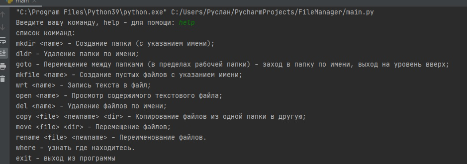
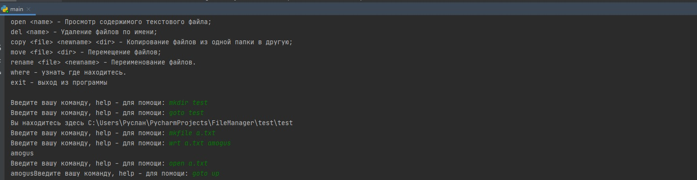
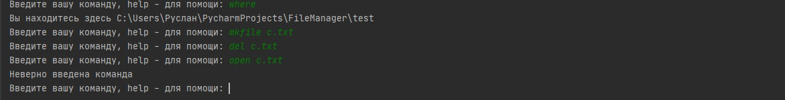

# Файл менеджер
Нужно сделать базовый файл менеджер для работы с папками и файлами
Примеры работы и объяснение:

Для того, что бы узнать список команд нужно ввести команду help

Теперь, зная как называются команды уже можно работать

создаем папку и заходим в нее
создаем текстовый файл a.txt
пишем в него текст "amogus"
читаем этот файл
выходим на папку выше

создадим файл c.txt
и сразу же удаляем
пытаемся открыть и видим что происодит ошибка, так как файл уже удален
